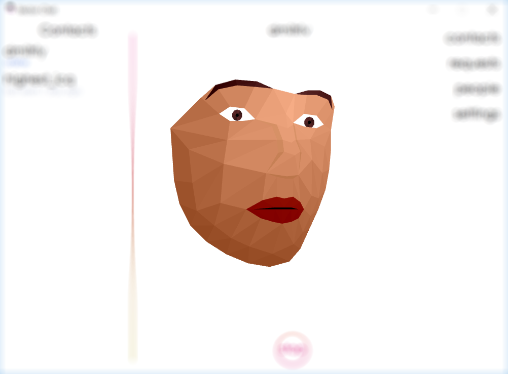

# Vector chat
Vector Chat hides your face behind a virtual avatar

## Execution
1. Download the app -  https://mega.nz/#F!pt8lXCSJ!xANWJTFaIlWqOqZP2VRKtw
2. Extract files from the archive
4. Sign up and download the app
open in a browser - http://35.228.127.113
5. Start the app (only for  Windows 7 or higher, 64bit)
client_build/authorization.exe
- if you want to fast test the app go to the global search, find yourself and send the request, open the requests list and accept one, then go to the contacts and ring yourself